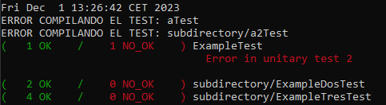

# Unit Testing para C++
Este proyecto consiste en unas herramientas que permiten realizar test unitarios sobre programas escritos en C++.

En el directorio se puede encontrar una carpeta llamada `test` en la que irán la librería de testeo y todos los test; estos test implementarán la clase descrita en el fichero `Test.h` y que deberán terminar con Test.cpp; por ejemplo, un test para una **clase llamada Reloj se llamaría RelojTest.cpp**.

También se pueden encontrar un fichero `test.sh`, este fichero es el encargado de ejecutar los test unitarios dentro de una terminal. Para ejecutar todos los test hay que ejecutar el comando:

```
./test.sh
```

Estas herramientas tienen dos dependencias: `dos2unix` y `tree`, la primera se utiliza para sustituir los saltos de línea de Windows por los de Linux en caso de que se programe desde un sistema con Windows ya que sino el script `test.sh` no funcionará; y el segundo permite al script recorrer todos los directorios en busca de ficheros que compilar; para instalarlos se puede ejecutar el comando:
```
sudo apt install dos2unix
sudo apt install tree
```

### Testing
Para realizar los testeos las clases que implementarán los test unitarios deben heredar de la clase Test antes mencionada; aquí hay un ejemplo de test unitario.
```cpp
/* AQUÍ VAN LAS IMPORTACIONES */
#include <stdio.h>
#include "Test.h"

using namespace std;

/* ESTA ES LA CLASE DE TEST QUE HEREDA DE TEST */
class ExampleTest: public Test{
    public:
        using Test::Test;   // HEREDAMOS EL CONSTRUCTOR

        /* ESTE METODO SE ENCARGA DE EJECUTAR TODAS LAS ASSERCIONES */
        void execute(){
            /* AQUÍ HAY QUE IR INCLUYENDO LOS DIFERETES TEST UNITARIOS */
            assert(unitTestExample);
        }

        /* ESTO ES LA ESPECIFICACIÓN DE UN TEST UNITARIO */
        static bool unitTestExample();
};

/* ESTA ES LA IMPLEMENTACIÓN DEL TEST UNITARIO */
bool ExampleTest::unitTestExample2(){
    /* AQUÍ VAN TODAS LAS COMPROBACIONES NECESARIAS */
    return true;
}

/* ESTA PARTE EJECUTA EL TEST */
int main(int argc, char** argv){
    ExampleTest *test = new ExampleTest(argv[1]);

    /* ESTO EJECUTA TODOS LOS TEST */
    test->assertAll();

    return test->no_passes;
}
```

### Testeo
Una vez hemos ejecutado el comando `./test.sh` se nos generará un fichero `test.log` que contiene un texto formateado con el resultado del testeo, este fichero se visualizará automáticamente pero quedará almacenado en la raiz del proyecto para facilitar la corrección del código.

Si en algún momento se desea volver a ver el log basta con ejecutar
```
cat test.log
```

En este output se pueden leer rápidamente el nombre de los fichero y ver si ha ocurrido algún error y en caso de que los hubiese en que numero de test unitario ha ocurrido.

También se pueden observar el numero de checks verdes y rojos a la izquierda del nombre del fichero.

<center></center>

